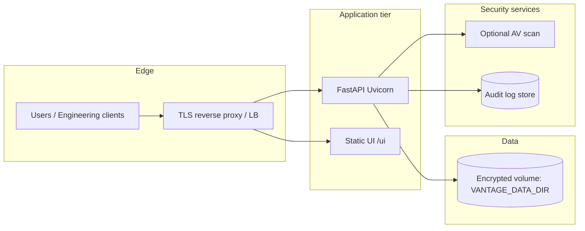

# Deployment and security guidance

This document covers **local** rollout first, then **hardening** for sensitive engineering documents processed by the Army Vantage **FastAPI** API and **HTML** UI (`/ui/`).

The app accepts uploads, writes them under `VANTAGE_DATA_DIR`, runs extraction → chunking → export, and serves ZIP results. Treat **all uploads as untrusted** until validated by policy and tooling.

---

## 1. Local deployment (development)

### 1.1 Prerequisites

- Python 3.11+
- System dependencies for PDF/OCR as required by your environment (e.g. Tesseract for OCR paths)
- Install the project: `pip install -e ".[api]"`

### 1.2 Configuration

Copy `.env.example` to `.env` and set at least:

| Variable | Purpose |
|----------|---------|
| `VANTAGE_DATA_DIR` | Root for job workspaces (default `./var/vantage`) |
| `VANTAGE_MAX_UPLOAD_BYTES` | Per-file byte limit (default 100 MiB) |
| `VANTAGE_MAX_FILES_PER_JOB` | Files per request (default 50) |
| `VANTAGE_API_HOST` / `VANTAGE_API_PORT` | Bind address (use **`127.0.0.1`** locally to avoid exposing the API on all interfaces) |

### 1.3 Run the API

```bash
python -m vantage_api
```

Open `http://127.0.0.1:8000/ui/` (or the configured host/port). Use **`127.0.0.1`**, not `0.0.0.0`, for everyday dev unless you intentionally need LAN access.

### 1.4 CORS

The app enables **permissive CORS** (`allow_origins=["*"]`) for developer convenience. **Tighten or remove CORS** before any shared or production deployment (see §7).

---

## 2. Secure file upload handling

### 2.1 What the app already does

- **Allowlist extensions:** only `.pdf`, `.docx`, `.txt` (see `_allowed_suffix` in the jobs router).
- **Filename sanitization:** path separators in client-provided names are rejected; stored names use a controlled pattern under `jobs/{job_id}/inputs/`.
- **Per-file size cap:** `VANTAGE_MAX_UPLOAD_BYTES` enforced after read (align with reverse proxy / WAF limits).
- **Per-request file count:** `VANTAGE_MAX_FILES_PER_JOB`.

### 2.2 Gaps and hardening

| Risk | Mitigation |
|------|------------|
| **Memory exhaustion** | Uploads are read into memory (`await uf.read()`). Keep `VANTAGE_MAX_UPLOAD_BYTES` **low** on small VMs; add a **reverse proxy** body size limit (e.g. Nginx `client_max_body_size`). Prefer **streaming to disk** with a hard cap in a future change for very large allowances. |
| **Malicious content** | Extension allowlisting is **not** sufficient. Run **antimalware** (ClamAV, enterprise AV) on a **quarantine** path before processing, or scan at an API gateway. |
| **ZIP/XML bombs (DOCX)** | DOCX is a ZIP; extremely nested or huge archives can stress parsers. Keep size limits strict; consider **timeout** and **resource limits** on worker processes (systemd, containers). |
| **PDF exploits** | PyMuPDF parses PDFs; keep **dependencies patched** (`pip audit`, OS updates). Run in an **isolated** service account with minimal privileges. |
| **SSRF / path tricks** | Processing uses local paths only; do not pass user-controlled strings into shell commands (current design avoids this). |

### 2.3 Recommended upload path (production)

1. **TLS termination** at reverse proxy (HTTPS only).
2. **Body size** limit at proxy ≤ `VANTAGE_MAX_UPLOAD_BYTES`.
3. Optional **WAF** / rate limiting (per IP or API key).
4. **Scan** then **move** into `VANTAGE_DATA_DIR` (or mount quarantine volume).
5. Process with **least-privilege** OS user (see §8).

---

## 3. File size limits

- **Application:** `VANTAGE_MAX_UPLOAD_BYTES` (see `.env.example`; default 104857600 bytes).
- **Pipeline:** `IntakeLimits.max_bytes` matches API settings for batch runs.
- **Operational rule:** Set the **proxy** limit slightly **below** or **equal to** the app limit so the app returns controlled errors rather than connection resets.

Also cap **`VANTAGE_MAX_FILES_PER_JOB`** to reduce aggregate size per job (N × max bytes).

---

## 4. Temporary file cleanup

### 4.1 Where data lives

- Uploads and artifacts: under **`VANTAGE_DATA_DIR/jobs/{job_id}/`** (inputs, `output/`, ZIP staging, `processing_report.json`, etc.).
- **In-memory job index:** `JobStore` is process-local; it is **not** durable across restarts.

### 4.2 Cleanup practices

| Practice | Detail |
|----------|--------|
| **Retention policy** | Define max age (e.g. 24–168 hours) for `jobs/*` and enforce with **cron**, **systemd timer**, or a small janitor job. |
| **Secure deletion** | For CUI/PII, use org-approved **wiping** on supported filesystems or **encrypted volumes**; deleting files may not erase flash-backed storage—follow your **records management** policy. |
| **Post-download** | Optionally delete job directory automatically after successful download (not implemented by default—add if policy requires). |
| **Disk quotas** | Place `VANTAGE_DATA_DIR` on a dedicated volume with **monitoring** and **alerts**. |

---

## 5. Preventing malicious uploads

- **Allowlist** extensions only (already enforced); avoid adding “any MIME” handlers without review.
- **Validate** that declared type matches magic bytes where feasible (optional enhancement: `python-magic` / `filetype`).
- **Scan** with antivirus before `extract_structured`.
- **Sandbox** processing (container with no outbound network, read-only image root, writable only `VANTAGE_DATA_DIR`).
- **Rate limit** uploads at the edge (per user/IP) to reduce abuse.
- **Disable** public `0.0.0.0` binds unless required; prefer **private network** + **VPN** or **mTLS** for on-prem.

---

## 6. Logging and audit trail

### 6.1 Application logs

- Use structured logging where possible (**job_id**, **source_filename**, stages, durations). Avoid logging **full document text** or **PII** in clear text.
- Uvicorn access logs: IP, method, path, status—useful for **who** called **which** endpoint.
- Correlate pipeline logs with **`job_id`** (already logged in batch processing).

### 6.2 Audit trail (recommended additions)

| Event | Fields |
|-------|--------|
| Upload accepted | timestamp, authenticated principal (future), job_id, file count, total bytes, client IP |
| Job complete / failed | job_id, duration, outcome, error summary (no raw stack traces to users) |
| Download | job_id, timestamp, principal |

Persist audit events to **append-only** storage (database table, SIEM, syslog) per your **RMF** / program requirements.

### 6.3 Artifacts

- `processing_report.json` and `run_manifest.json` in each job output support **operational** review; protect them with the same controls as source files.

---

## 7. On-premises deployment options

| Pattern | Description |
|---------|-------------|
| **Single VM** | Uvicorn + systemd; Nginx TLS in front; data on encrypted disk. |
| **Split tiers** | Stateless API VMs behind load balancer; shared NFS or SAN for `VANTAGE_DATA_DIR` (watch locking and cleanup). |
| **Air-gapped** | No outbound internet; **offline** `pip` / wheelhouse; vendor PDF/OCR deps bundled; updates via controlled media. |
| **Kubernetes** | Deployment + Service; **PersistentVolumeClaim** for `VANTAGE_DATA_DIR`; **NetworkPolicy** to restrict egress. |

Always place the API **behind** TLS and restrict **admin** endpoints (`/docs` can be disabled in production—see FastAPI `docs_url=None`).

---

## 8. Containerization (Docker)

### 8.1 Recommended practices

- **Base image:** Official slim Python (pin digest).
- **User:** Non-root `USER` in Dockerfile; run Uvicorn as that user.
- **Filesystem:** Read-only container root where possible; mount **one writable volume** at `VANTAGE_DATA_DIR`.
- **Secrets:** Inject via **secrets** (K8s secrets, Docker secrets), not baked into images.
- **Health:** Map `GET /health` for orchestrator probes.

### 8.2 Example shape (illustrative)

```dockerfile
FROM python:3.12-slim-bookworm
WORKDIR /app
RUN useradd -m -u 1000 appuser
COPY pyproject.toml README.md ./
COPY src ./src
RUN pip install --no-cache-dir -e ".[api]"
USER appuser
ENV VANTAGE_DATA_DIR=/data
VOLUME ["/data"]
EXPOSE 8000
CMD ["python", "-m", "uvicorn", "vantage_api.app:create_app", "--factory", "--host", "0.0.0.0", "--port", "8000"]
```

Bind **`0.0.0.0`** only **inside** the container; restrict with **Docker/K8s networking** and **firewall** so the port is not world-reachable unless intended.

---

## 9. Recommended deployment architecture



- **Single entry** via TLS; optional **WAF** and **rate limiting**.
- **API** and **static UI** can be served from the same process (current design) or split (UI on CDN/object storage with strict CSP).
- **Secrets** and **config** from environment / secret manager.
- **Backups** of policy-critical config only; **avoid backing up** raw CUI to insecure stores.

---

## 10. Future authentication and authorization

The current API is **unauthenticated**—suitable only for **trusted networks** or **local** use.

| Approach | Use when |
|----------|----------|
| **API keys** (header `X-API-Key` or `Authorization: Bearer`) | Simple service-to-service or small team; rotate keys; store hashed server-side if you add a DB. |
| **OAuth2 / OIDC** (e.g. Keycloak, Azure AD) | Enterprise SSO, MFA, group-based access. |
| **mTLS** | High-assurance on-prem; client certificates at load balancer. |
| **Network-only auth** | Private VLAN + VPN—no app-level auth (weakest; rely on network controls). |

**Authorization** should eventually map **identity → quotas** (max bytes, max jobs) and **optional** row-level rules if multi-tenant.

Implementation notes for a future change:

- Add **FastAPI dependencies** for `get_current_user` / `verify_api_key`.
- **Disable** `/docs` and OpenAPI in production or protect behind admin auth.
- Log **subject id** on upload/download for audit.

---

## 11. Quick checklist (sensitive documents)

- [ ] `VANTAGE_DATA_DIR` on **encrypted** storage with **restricted** OS permissions.
- [ ] **TLS** in front; no plain HTTP for uploads/downloads.
- [ ] **Tight** `VANTAGE_MAX_UPLOAD_BYTES` and **proxy** body limits aligned.
- [ ] **CORS** restricted to known UI origins.
- [ ] **Non-root** service account; container **read-only** root if using Docker.
- [ ] **Cleanup** job + disk monitoring.
- [ ] **Logging** without sensitive file contents; **audit** trail for upload/download.
- [ ] **Dependency** and **OS** patching process.
- [ ] **Authentication** plan before exposing beyond localhost/VPN.

For testing strategy, see `docs/TESTING_STRATEGY.md`. For API behavior, see `docs/API_ARMY_VANTAGE.md`.
